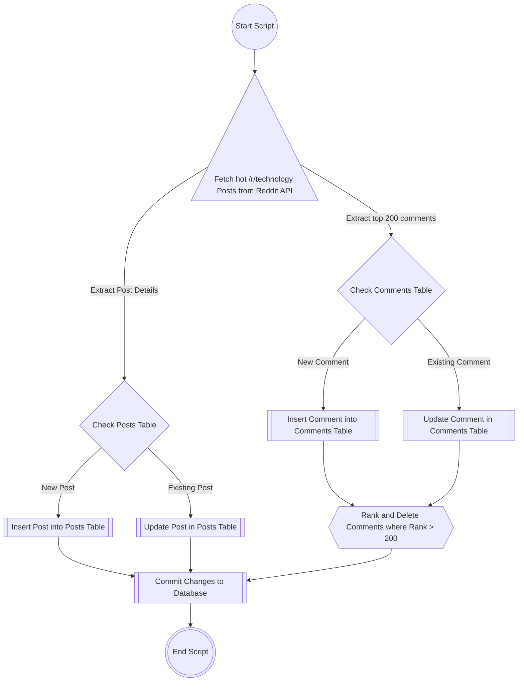

# 

# Reddit /r/technology Data Pipeline and Analysis
## Anthony Squire - DF Capstone Project

### Project Requirements
1. Choose a website, API or RSS feed. It must be something that updates frequently
2. Create a script or process that obtains the data. (This script will eventually be run periodically)
   1. Consider efficiency -> Don't scrape all data every time, just the new data
3. Put the data into a table or series of tables in the SQL sandbox (DF pagila database) or preferred location
4. Create a visualisation that demonstrates an aspect of the data

### Expected Outputs
1. Project plan
2. Data flow diagram
3. Demo of script and visualisation
4. Presentation of process and product

## Project Brief
### Objective
Build a pipeline that regularly collects data from the /r/technology subreddit and stores it in a postgreSQL database. Then conduct analysis on the data and generate some visualisations. Finally, produce a streamlit app to showcase the data and visualisations along with any insights.

### Aims
Through this project I aim to uncover trends and insights from the /r/technology subreddit through analysis of the most discussed topics and the corresponding responses and sentiments of the commenters. By visualising the data with tools such as word clouds I hope to identify recurring themes, emerging technologies and areas of interest within the /r/technology community on any given day, then by keeping the data in a postgreSQL database, see how this might change over time. Ultimately I want to utilise the knowledge I have gained while in the Digital Futures academy and use this project to improve and showcase my data engineering skills.

### Project Plan Overview
- Utilise the reddit API to get the top 10 hot posts in the r/technology subreddit
- Produce a script that executes the data pipeline to be ran every hour or so
- Store the post data in a posts table, recording the following:
  - post id
  - title 
  - url 
  - datetime published
  - score
  - number of comments
- Store the top 200 comments data in a comments table recording the following:
  -  comment id
  -  post id
  -  body
  -  score
  -  datetime published
- Create and deploy a streamlit app showcasing my analysis and visualisations:
  - Generate a word cloud of the most common words seen in post titles each day and another for the comments of each post
  - Perform sentiment analysis of the comments and display this in some way
  - Identify any trending subjects for each day

### Project Timeline
- Day 1:
  - Decide upon an API and direction of analysis
  - Begin project plan
  - Exploration of API and required technologies
- Day 2:
  - Produce and submit a script to facilitate the data extraction, transformation and loading
  - Produce and submit a brief project plan
- Day 3:
  - Conduct data analysis
  - Produce visualisations
  - Design and create a streamlit app to showcase the collected data
- Day 4:
  - Create a presentation of the project
- Day 5:
  - Deliver presentation and demo

## Data Flow Diagrams
> The mermaid extension may be required for the flowcharts to display correctly
### Overall Process Flow Diagram


### Data Collection Script FLow Diagram



## Data Collection Script Execution
To run the data extraction, please ensure the required libraries are installed from the requirements.txt file
A .env file will also be required in the main project directory with the following:

```plaintext
# Database Configuration
DB_HOST='db_host_address'
DB_USERNAME='db_username'
DB_PASSWORD='db_password'
DB_DATABASE='database_name'
DB_PORT=db_port_number


# Reddit API configuration
REDDIT_CLIENT_ID='reddit_app_id'
REDDIT_CLIENT_SECRET='reddit_client_secret'
REDDIT_USER_AGENT='appropriate_user_agent'
```
Once these are in place you can then run the pipeline.py file to extract the data and load it into the database.