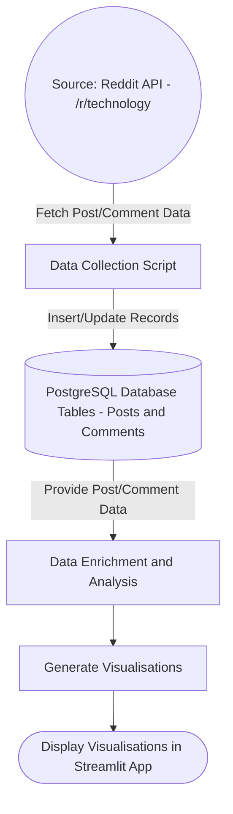

# 

# Anthony Squire - Capstone Project

## Project Requirements
1. Choose a website, API or RSS feed. It must be something that updates frequently
2. Create a script or process that obtains the data. (This script will eventually be run periodically)
   1. Consider efficiency -> Don't scrape all data every time, just the new data
3. Put the data into a table or series of tables in the SQL sandbox (DF pagila database) or preferred location
4. Create a visualisation that demonstrates an aspect of the data

## Expected Outputs
1. Project plan
2. Data flow diagram
3. Demo of script and visualisation
4. Presentation of process and product

## Proposed Project
- Utilise the reddit API to get the top 10 hot posts in the r/technology subreddit every few hours
- Store the post data in a posts table
  - id
  - title 
  - url 
  - datetime published
  - score
- Store the top 200 comments data in a comments table
  -  id
  -  post id
  -  body
  -  score
  -  datetime published
- Create and deploy a streamlit app showcasing my analysis and visualisations:
  - Generate word cloud of the most common words seen in post titles each day and in the comments of each post
  - Perform sentiment analysis of the comments and display this some way
  - Identify any trending subjects for each day

## Data Flow Diagrams

### Overall Process

### Data Collection Script

